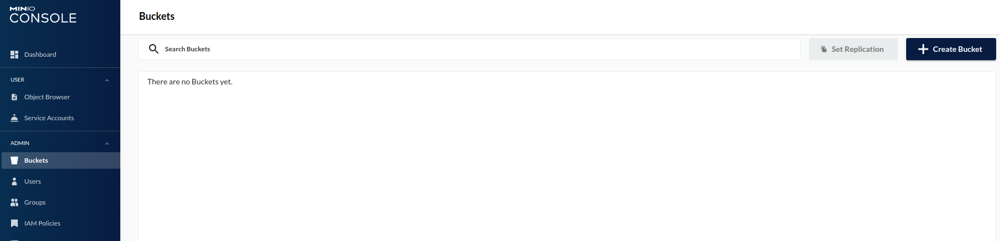
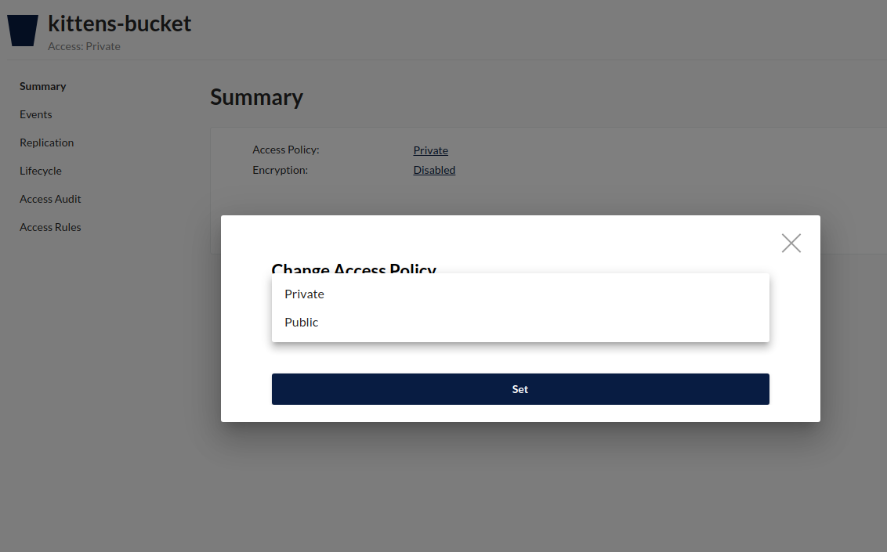

# How to use Pollen Solutions Filesystem component with minio

## Install

### Clone the repository from Github

```bash
git clone git@github.com:jordy-manner/lab-filesystem-minio.git
```

### Install dependencies

```bash
composer install
```

### Launch the minio service

```bash
docker-compose up
```

## Configure Minio

### Connexion

Visit: [http://127.0.0.1:9001](Minio Console)

Enter the username (minio) and the password (minio123).


### Create a bucket

Open bucket interface



Create a bucket named **kittens-bucket**


### Change permissions

Select the bucket and change Access Policy from **Private** to **Public** in Summary tab.



## Launch application

```bash
php -S 127.0.0.1:8000
```

Visit: http://127.0.0.1:8000